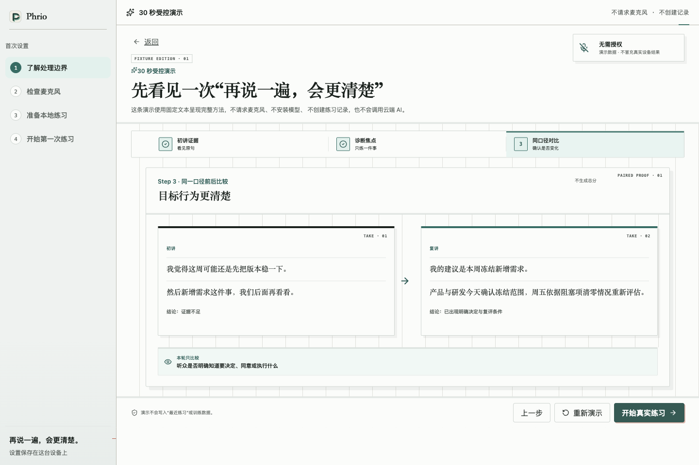
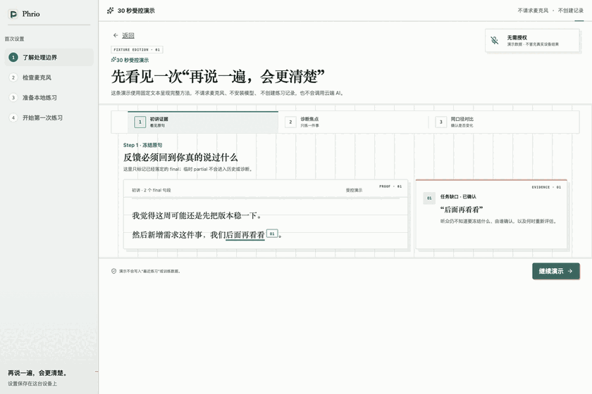

<p align="center">
  
</p>

<h1 align="center">Phrio</h1>

<p align="center">
  <strong>说一遍。找到一个可行动的焦点。再说一遍，更清楚。</strong>
</p>

<p align="center">
  一款本地优先的中文口头表达刻意练习桌面应用。Phrio 把反馈锚定到你真正说过的句子，
  再用同一个冻结标准比较前后两次表达——不虚构一个看似精确的表达总分。
</p>

<p align="center">
  <a href="README.en.md">English</a> ·
  <a href="#30-秒受控演示">30 秒演示</a> ·
  <a href="#快速开始">快速开始</a> ·
  <a href="CONTRIBUTING.md">参与贡献</a> ·
  <a href="SECURITY.md">安全说明</a>
</p>

<p align="center">
  <sub>macOS Apple Silicon · 本地优先 · 无需账号 · MIT</sub>
</p>

<p align="center">
  <a href="https://github.com/Dewensong/phrio-speech-coach/actions/workflows/ci.yml">
    
  </a>
</p>

> [!IMPORTANT]
> Phrio 目前是面向 macOS Apple Silicon 的 **Internal Alpha**。源码、自动化门禁和
> 受控 Fixture 已公开，但尚未发布经过 Developer ID 签名与 Apple 公证的公共安装包。

## 练的是这句话，不是表达总分

许多表达工具要么给出一个笼统分数，要么直接替你改写答案。Phrio 把“表达得更清楚”
设计成一次短小、可复查的编辑排练：

| 看证据，不凭感觉 | 只练一个焦点 | 同口径复讲，不制造胜负 |
| --- | --- | --- |
| 反馈指回触发判断的真实 final 原句。 | 你选择一个可行动标准，也可以在诊断后直接结束。 | 第二次表达只比较已经冻结的那个标准。 |

整个训练闭环仍由练习者掌控：

1. **开口表达**：使用真实麦克风和本地流式 ASR。
2. **查看证据**：定位到实际说出的 final 句子。
3. **选择一个焦点**：完成短 Drill，或在诊断后结束。
4. **同题复讲**：只按冻结标准进行前后比较。
5. **保存或分享**：在本机生成隐私安全的结果卡。

本地训练闭环不要求账号，也不依赖云服务。可选 OpenAI 功能默认关闭；只有用户配置
Key，并针对具体用途完成独立同意后，才允许发送相应的 final 文本。

<p align="center">
  
</p>

<p align="center">
  <sub>真实打包 UI，受控演示数据；未请求麦克风、未安装模型、未创建记录、未调用云端。</sub>
</p>

## 30 秒受控演示

应用内置完整方法演示，不需要麦克风权限，不下载本地 ASR 模型，不创建练习记录，
也不调用任何云端服务。

<p align="center">
  
</p>

演示数据始终带有 Fixture 标识。它用于展示产品方法，不冒充真实麦克风、本地模型
质量或云端模型效果证据。

## 已实现能力

- 本地麦克风采集、设备选择、输入健康提示、回放、重试和删除。
- Sherpa-ONNX 本地流式 ASR，区分 partial / final，支持恢复路径、冻结时间码和
  可断点续传的模型安装器。
- 锚定原句证据的本地诊断、一个可选焦点、短 Drill、同题复讲与同口径比较。
- 双记录视图：当前诊断结果，以及录制时冻结的实时证据账本。
- 在本机生成 16:10、1:1、9:16 的 PNG / SVG / Markdown 结果卡。证据原句默认
  不展示，完整逐字稿永不进入结果卡。
- 浅色 / 深色 / 跟随系统主题、受约束配色、文字缩放、减少动效、键盘焦点恢复，
  以及 1024 px 紧凑布局。
- 可选 OpenAI 实时提示、深度诊断和语义比较；三种用途保持独立同意边界。
- 仓库内社区 Task Pack 在构建期校验，不下载或执行远程插件代码。

需要查看完整状态、Fast / Deep Lane、诊断日志和降级边界时，请阅读
[中文 Internal Alpha 技术说明](docs/internal-alpha.zh-CN.md)。

## 隐私模型

| 数据 | 默认位置 | 云端边界 |
| --- | --- | --- |
| 音频与 PCM | 本机 | 永不进入 AI payload |
| Partial 逐字稿 | 实时内存 | 不持久化，不上传 |
| Final 逐字稿与练习记录 | 本机 SQLite | 仅在对应 AI 用途明确开启并批准后发送 |
| 分享卡 | 用户操作后在本机生成 | 不创建公共链接 |
| 诊断日志 | 本机轮换日志 | 仅在用户选择路径后导出 |

应用没有遥测，也不要求账号。完整边界见
[中文 Internal Alpha 技术说明](docs/internal-alpha.zh-CN.md)和
[安全政策](SECURITY.md)。

## 快速开始

环境要求：

- Apple Silicon Mac
- Node.js `24.18.0` 或更高版本
- pnpm `10.33.2`

```bash
pnpm install --frozen-lockfile
pnpm start
```

如果只想无权限体验产品，在首屏选择 **30 秒受控演示**。真实练习需要先安装约
226.2 MiB 的冻结本地模型，并在开始录音时授权麦克风。

运行完整生产门禁：

```bash
pnpm verify
```

运行真实 Electron 视觉与受控产品巡检：

```bash
pnpm verify:electron-visual
pnpm verify:electron-product-tour
```

## 下载与分发

[源码仓库](https://github.com/Dewensong/phrio-speech-coach)已经公开，但目前没有
公共二进制 Release。CI 生成的是短期、明确标注为 ad-hoc 的 Internal Alpha
证据包，不是经过 Apple 公证的公开安装器。

仓库已经具备：

- 正式 Phrio 图标和 macOS DMG maker；
- 由环境门控制的 Developer ID 签名与公证流程；
- 缺少 Apple 凭据时主动拒绝运行的手动候选发布 workflow；
- ad-hoc 内测与公共分发相互独立的验证边界。

正式发布仍需要维护者提供 Apple Developer 身份、公证凭据并再次明确批准。参见
[macOS 公共分发说明](docs/release/public-macos-distribution.md)和
[GitHub 源码发布检查](docs/release/github-open-source-readiness.md)。
完成源码检查不等于发布二进制。

## 社区 Task Pack

Phrio 目前接受现有“清晰表达”“决策与对齐”“观点与反驳”模式下的纯任务贡献。
Pack 是经过 Review 的 JSON，在构建期编译进应用，并采用 MIT 许可。

可以从
[`task-packs/contributions/product-review.json`](task-packs/contributions/product-review.json)
开始，并阅读 [Task Pack 贡献指南](task-packs/README.md)。

## 仓库结构

```text
src/
├── frontend/      # 页面、组件、Hook 与 Renderer Service
├── backend/       # IPC Controller、Service、SQLite / 文件 Repository
├── preload/       # 窄类型桌面桥
└── shared/        # Schema、状态机与冻结协议

task-packs/        # 构建期校验的社区练习任务
docs/              # ADR、验收证据、发布和品牌说明
build/             # 权限与确定性品牌资产
```

## 三类证据

Phrio 始终区分：

- **自动化证据**：单元、集成、打包、安全和布局门禁。
- **受控 Fixture 证据**：真实 Electron / IPC / SQLite 流程，使用明确标注的
  合成数据。
- **真实设备证据**：真实麦克风、本地模型、设备中断、性能以及明确授权的云端调用。

三类证据不能相互替代。当前证据位于
[`docs/acceptance`](docs/acceptance)。源码历史隐私、许可证、workflow 权限、
远端 CI 与 clean-clone 结果见
[2026-07-24 GitHub 源码公开验收](docs/acceptance/2026-07-24-github-source-publication.md)；
完整主题、缩放、键盘、受控 Fixture 和真实设备边界见
[2026-07-24 全产品终验](docs/acceptance/2026-07-24-editorial-rehearsal-final-acceptance.md)；
此前的真实麦克风停止收束和传播边界见
[2026-07-23 验收](docs/acceptance/2026-07-23-open-source-propagation-release-readiness.md)。

## 参与贡献

提交变更前请阅读 [CONTRIBUTING.md](CONTRIBUTING.md)。适合开始的贡献包括练习任务、
可访问性改进、确定性 UI 测试、文档，以及不破坏隐私与证据模型的平台调查。

请勿提交真实录音、逐字稿、客户材料、API Key、公证凭据或生成后的模型权重。

## 许可证

Phrio 自有源码与仓库资产使用 [MIT License](LICENSE)。第三方依赖和模型文件保留
各自许可，详见 [THIRD_PARTY_NOTICES.md](THIRD_PARTY_NOTICES.md)。Sherpa 模型
权重单独下载，不包含在本仓库中。
